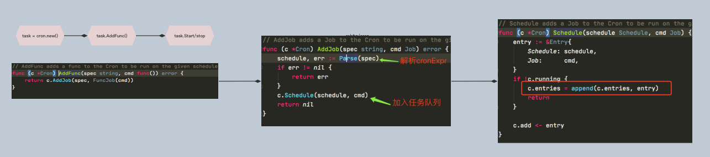
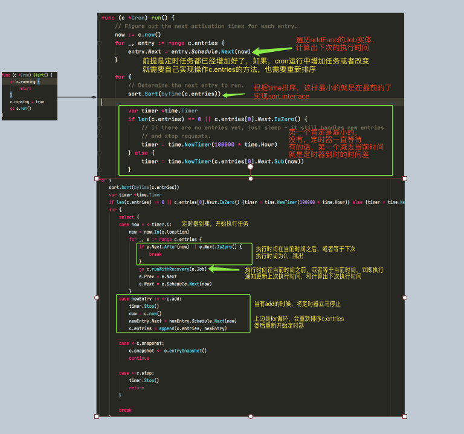
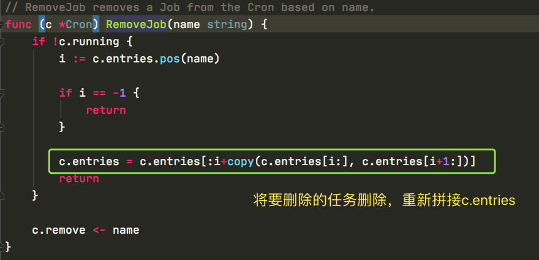

# 几种cron实现对比

# github.com/robfig/cron

## 1、用法

[常规用法](https://blog.csdn.net/qq_39787367/article/details/109673599)

## 2、实现


AddFunc



task.Run




# web版本github.com/ouqiang/gocron

```go
https://github.com/ouqiang/gocron
```

## 修改任务




## 添加任务

直接添加就可以，会重新排序c.entries的


