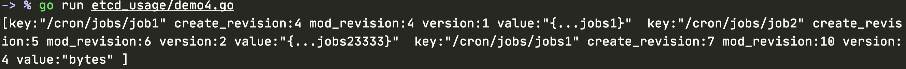
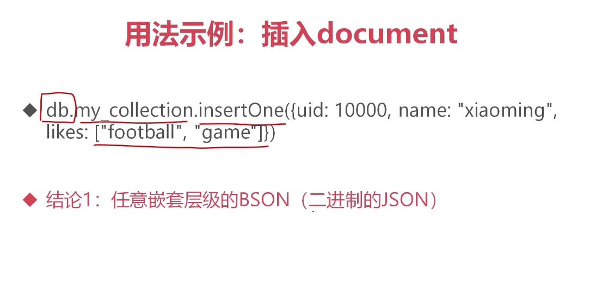

# 1、ETCD安装

> 1. 下载对应平台
>
>    ```
>    https://github.com/etcd-io/etcd/releases
>    ```
>
> 2. 解压
>
>    ```
>    tar -zxvf etcd-v3.4.14-darwin-amd64.zip
>    ```
>
> 3. 启动单机版---开发使用 不建议使用
>
>    ```
>    nohup ./etcd --listen-client-urls 'http://0.0.0.0:2379' --advertise-client-urls 'http://0.0.0.0:2379 &
>    ```
>
>    


## etcdctl

<font color=red size=5x>**ETCD的底层存储是按key有序存储的**</font>

<font color=red size=5x>**实时监控集合的变化**</font>

指定版本启动

```
 ETCDCTL_API=3 ./etcdctl
```


> 1、设置key value
>
> ```
> ETCDCTL_API=3 ./etcdctl put "name" "oen"
> 
> ```
>
> 


> 2、获取key
>
> ```
> -> % ETCDCTL_API=3 ./etcdctl get "name"      
> name
> oen
> ```


> 3、删除key
>
> ```
> ETCDCTL_API=3 ./etcdctl del "name"
> 1
> ```
>
> 


> 4、模糊查询 --prefix
>
> ```
> ETCDCTL_API=3 ./etcdctl get "/cron/jobs/" --prefix
> /cron/jobs/job1
> {...jobs1}
> /cron/jobs/job2
> {...jobs2}
> 
> ```
>
> 


> 5、 从那个key开始查询 --from-key
>
> ```
>  ETCDCTL_API=3 ./etcdctl get "/cron/jobs/job1" --from-key
> /cron/jobs/job1
> {...jobs1}
> /cron/jobs/job2
> {...jobs2}
> 
> ```
>
> 

### 2、watch

```
 ETCDCTL_API=3 ./etcdctl watch -h

```


```
OPTIONS:
  -h, --help[=false]            help for watch
  -i, --interactive[=false]     Interactive mode
      --prefix[=false]          Watch on a prefix if prefix is set//watch 一个前缀的集合
      --prev-kv[=false]         get the previous key-value pair before the event happens
      --rev=0                   Revision to start watching

```


开启新session

```
ETCDCTL_API=3 ./etcdctl watch "/cron/jobs/" --prefix
```


在另一个session修改

```
ETCDCTL_API=3 ./etcdctl put "/cron/jobs/job2" "{...jobs23333}" 
OK

```


## 2、编码

```
go mod edit -replace github.com/coreos/bbolt@v1.3.4=go.etcd.io/bbolt@v1.3.4
go mod edit -replace google.golang.org/grpc@v1.29.1=google.golang.org/grpc@v1.26.0
```


#### 1、获取连接

```go
package main

import (
	"fmt"
	"go.etcd.io/etcd/clientv3"
	"log"
	"time"
)

//建立连接

func main() {
	var (
		conf   clientv3.Config
		client *clientv3.Client
		err    error
	)

	conf = clientv3.Config{
		Endpoints:   []string{"127.0.0.1:2379"},
		DialTimeout: 5 * time.Second,
	}

	//建立连接
	if client, err = clientv3.New(conf); nil != err {
		log.Fatal(err)
	}
	fmt.Println(client)
}

```


#### 2、put Key及查看原来的值

```go
package main

import (
	"context"
	"fmt"
	"go.etcd.io/etcd/clientv3"
	"log"
	"time"
)

func main() {
	var (
		conf   clientv3.Config
		client *clientv3.Client
		err    error
		kv     clientv3.KV
		putRes *clientv3.PutResponse
	)

	conf = clientv3.Config{
		Endpoints:   []string{"127.0.0.1:2379"},
		DialTimeout: 5 * time.Second,
	}

	//建立连接
	if client, err = clientv3.New(conf); nil != err {
		log.Fatal(err)
	}

	//put key
	kv = clientv3.NewKV(client)

	//查看前一次的值 clientv3.WithPrevKV()
	//查看相同前缀的
	if putRes, err = kv.Put(context.TODO(), "/cron/jobs/jobs1", "bytes", clientv3.WithPrevKV()); nil != err {
		log.Fatal(err)
	} else {
		fmt.Println(putRes.Header)       //cluster_id:14841639068965178418 member_id:10276657743932975437 revision:7 raft_term:3
		fmt.Println(putRes.PrevKv)       //nil
		fmt.Println(putRes.OpResponse()) //{0xc000352270 <nil> <nil> <nil>}
	}
}


```


#### 3、获取key-value

```go
package main

import (
	"context"
	"fmt"
	"go.etcd.io/etcd/clientv3"
	"log"
	"time"
)

func main() {
	var (
		conf   clientv3.Config
		client *clientv3.Client
		err    error
		kv     clientv3.KV
		getRes *clientv3.GetResponse
	)

	conf = clientv3.Config{
		Endpoints:   []string{"127.0.0.1:2379"},
		DialTimeout: 5 * time.Second,
	}

	//建立连接
	if client, err = clientv3.New(conf); nil != err {
		log.Fatal(err)
	}

	//put key
	kv = clientv3.NewKV(client)

	if getRes, err = kv.Get(context.TODO(), "/cron/jobs/jobs1"); nil != err {
		log.Fatal(err)
	} else {
		fmt.Println(getRes.Kvs)    //[key:"/cron/jobs/jobs1" create_revision:7 mod_revision:10 version:4 value:"bytes" ]
		fmt.Println(getRes.Header) //cluster_id:14841639068965178418 member_id:10276657743932975437 revision:10 raft_term:3
		fmt.Println(getRes.Count)  //1
	}
}

```


#### 4、按目录获取

```go
package main

import (
	"context"
	"fmt"
	"go.etcd.io/etcd/clientv3"
	"log"
	"time"
)

func main() {
	var (
		conf   clientv3.Config
		client *clientv3.Client
		err    error
		kv     clientv3.KV
		getRes *clientv3.GetResponse
	)

	conf = clientv3.Config{
		Endpoints:   []string{"127.0.0.1:2379"},
		DialTimeout: 5 * time.Second,
	}

	//建立连接
	if client, err = clientv3.New(conf); nil != err {
		log.Fatal(err)
	}

	//put key
	kv = clientv3.NewKV(client)

	//读取前缀key的所有选项
	if getRes, err = kv.Get(context.TODO(), "/cron/jobs/", clientv3.WithPrefix()); nil != err {
		log.Fatal(err)
	} else {
		fmt.Println(getRes.Kvs)
	}
}

```




#### 5、del操作

```go
package main

import (
	"context"
	"fmt"
	"go.etcd.io/etcd/clientv3"
	"log"
	"time"
)

func main() {
	var (
		conf   clientv3.Config
		client *clientv3.Client
		err    error
		kv     clientv3.KV
		delRes *clientv3.DeleteResponse
	)

	conf = clientv3.Config{
		Endpoints:   []string{"127.0.0.1:2379"},
		DialTimeout: 5 * time.Second,
	}

	//建立连接
	if client, err = clientv3.New(conf); nil != err {
		log.Fatal(err)
	}

	//put key
	kv = clientv3.NewKV(client)

	//del
	if delRes, err = kv.Delete(context.TODO(), "/cron/jobs/jobs1", clientv3.WithPrevKV()); nil != err {
		log.Fatal(err)
	}

	if len(delRes.PrevKvs) > 0 {
		fmt.Println(delRes.PrevKvs)
	}
}

```


#### 6、续租

```go
package main

import (
	"context"
	"fmt"
	"go.etcd.io/etcd/clientv3"
	"log"
	"time"
)

func main() {
	var (
		conf          clientv3.Config
		client        *clientv3.Client
		err           error
		leads         clientv3.Lease
		leadsGrantres *clientv3.LeaseGrantResponse
		leadsId       clientv3.LeaseID
		kv            clientv3.KV
		putRes        *clientv3.PutResponse
		getRes        *clientv3.GetResponse
		keepResChan   <-chan *clientv3.LeaseKeepAliveResponse
		keepRes       *clientv3.LeaseKeepAliveResponse
	)

	conf = clientv3.Config{
		Endpoints:   []string{"127.0.0.1:2379"},
		DialTimeout: 5 * time.Second,
	}

	//建立连接
	if client, err = clientv3.New(conf); nil != err {
		log.Fatal(err)
	}

	//申请租约
	leads = clientv3.NewLease(client)

	//申请一个10s的租约
	if leadsGrantres, err = leads.Grant(context.TODO(), 10); nil != err {
		log.Fatal(err)
	}
	//拿到租约id
	leadsId = leadsGrantres.ID

	//自动续租,启动协程，定期的取续租
	if keepResChan, err = leads.KeepAlive(context.TODO(), leadsId); nil != err {
		log.Fatal(err)
	}

	go func() {
		for {
			select {
			case keepRes = <-keepResChan:
				if keepRes == nil {
					fmt.Println("租约失效")
					goto END
				} else {
					fmt.Println("收到续租应答", keepRes.ID)
				}
			}
		}
	END:
	}()

	//获取kv PI子集
	kv = clientv3.NewKV(client)

	//put一个key，让其与租约关联起来，实现10s自动过期
	if putRes, err = kv.Put(context.TODO(), "/cron/lock/job1", "", clientv3.WithLease(leadsId)); nil != err {
		log.Fatal(err)
	}
	fmt.Println("写入成功", putRes.Header.Revision)

	//查看是否过期
	for {
		if getRes, err = kv.Get(context.TODO(), "/cron/lock/job1"); nil != err {
			log.Fatal(err)
		}

		if getRes.Count == 0 {
			fmt.Println("过期了")
			break
		}

		fmt.Println("还没过期", getRes.Kvs)
		time.Sleep(2 * time.Second)
	}
}

```


#### 7、watch

```go
package main

import (
	"context"
	"fmt"
	"go.etcd.io/etcd/clientv3"
	//"go.etcd.io/etcd/mvcc/mvccpb"
	"github.com/coreos/etcd/mvcc/mvccpb"
	"log"
	"time"
)

func main() {
	var (
		conf   clientv3.Config
		client *clientv3.Client
		err    error
		kv     clientv3.KV
		//putRes *clientv3.PutResponse
		getRes         *clientv3.GetResponse
		watchStartRevi int64
		watcher        clientv3.Watcher
		watchChan      clientv3.WatchChan
		watchRes       clientv3.WatchResponse
		event          *clientv3.Event
	)

	conf = clientv3.Config{
		Endpoints:   []string{"127.0.0.1:2379"},
		DialTimeout: 5 * time.Second,
	}

	//建立连接
	if client, err = clientv3.New(conf); nil != err {
		log.Fatal(err)
	}

	//put key
	kv = clientv3.NewKV(client)

	//模拟key的变化
	go func() {
		for {
			kv.Put(context.TODO(), "/cron/jobs/jobs7", "i am jobs7")

			kv.Delete(context.TODO(), "/cron/jobs/jobs7")
			time.Sleep(time.Second)
		}

	}()

	//先get当前值，并监听后续变化
	if getRes, err = kv.Get(context.TODO(), "/cron/jobs/jobs7"); nil != err {
		log.Fatal(err)
	}

	//现在key是存在的
	if len(getRes.Kvs) > 0 {
		fmt.Println("current", getRes.Kvs[0])
	}

	//创建监听版本,当前这个key的版本加1是监控开始版本
	watchStartRevi = getRes.Header.Revision + 1

	//创建监听器
	watcher = clientv3.NewWatcher(client)

	//启动监听
	fmt.Println("从该版本向后监听", watchStartRevi)
	watchChan = watcher.Watch(context.TODO(), "/cron/jobs/jobs7", clientv3.WithRev(watchStartRevi))

	//处理kv变化事件
	for watchRes = range watchChan {
		for _, event = range watchRes.Events {
			switch event.Type {
			case mvccpb.PUT:
				fmt.Println("修改为", string(event.Kv.Value), "revision", event.Kv.CreateRevision, event.Kv.ModRevision)
			case mvccpb.DELETE:
				fmt.Println("删除了", "revision", event.Kv.ModRevision)

			}
		}
	}
}

```


# 3、OP代码

```go
package main

import (
	"context"
	"fmt"
	"go.etcd.io/etcd/clientv3"
	"log"
	"time"
)

func main() {
	var (
		conf   clientv3.Config
		client *clientv3.Client
		err    error
		kv     clientv3.KV
		//delRes *clientv3.DeleteResponse
		putOp clientv3.Op
		getop clientv3.Op
		opRes clientv3.OpResponse
	)

	conf = clientv3.Config{
		Endpoints:   []string{"127.0.0.1:2379"},
		DialTimeout: 5 * time.Second,
	}

	//建立连接
	if client, err = clientv3.New(conf); nil != err {
		log.Fatal(err)
	}

	//put key
	kv = clientv3.NewKV(client)

	//OP
	putOp = clientv3.OpPut("/cron/jobs/job8", "")

	//执行op
	if opRes, err = kv.Do(context.TODO(), putOp); nil != err {
		log.Fatal(err)
	}

	fmt.Println(opRes.Put().Header.Revision)

	//getop
	getop = clientv3.OpGet("/cron/jobs/job8")

	//执行op
	if opRes, err = kv.Do(context.TODO(), getop); nil != err {
		log.Fatal(err)
	}

	fmt.Println("数据revision", opRes.Get().Kvs[0].ModRevision)
	fmt.Println("数据value", string(opRes.Get().Kvs[0].Value))
}

```


# 4、分布式乐观锁

```go
package main

import (
	"context"
	"fmt"
	"go.etcd.io/etcd/clientv3"
	"log"
	"time"
)

func main() {
	var (
		conf   clientv3.Config
		client *clientv3.Client
		err    error
		kv     clientv3.KV
		//delRes *clientv3.DeleteResponse
		//putOp clientv3.Op
		//getop clientv3.Op
		//opRes clientv3.OpResponse
		lease         clientv3.Lease
		leaseGrantRes *clientv3.LeaseGrantResponse
		leaseId       clientv3.LeaseID
		keepResChan   <-chan *clientv3.LeaseKeepAliveResponse
		keepRes       *clientv3.LeaseKeepAliveResponse
		ctx           context.Context
		canelFunc     context.CancelFunc
		txn           clientv3.Txn
		tsnResp       *clientv3.TxnResponse
	)

	conf = clientv3.Config{
		Endpoints:   []string{"127.0.0.1:2379"},
		DialTimeout: 5 * time.Second,
	}

	//建立连接
	if client, err = clientv3.New(conf); nil != err {
		log.Fatal(err)
	}

	//lease实现锁自动过期
	//op操作
	//txn 事务

	//1、上锁--创建租约，自动续租，拿着租约取抢占一个key
	//申请租约
	lease = clientv3.NewLease(client)
	//申请5s的租约
	if leaseGrantRes, err = lease.Grant(context.TODO(), 5); nil != err {
		log.Fatal(err)
	}

	//拿到租约id
	leaseId = leaseGrantRes.ID

	//准备取消续租的context
	ctx, canelFunc = context.WithCancel(context.TODO())

	//确保函数推出后，自动停止续租
	defer canelFunc()

	//立即释放租约
	defer func() {
		if _, err = lease.Revoke(context.TODO(), leaseId); nil != err {
			fmt.Println(err)
		}

	}()

	//自动续租
	if keepResChan, err = lease.KeepAlive(ctx, leaseId); nil != err {
		log.Fatal(err)
	}

	//处理应答续租的协程
	go func() {
		for {
			select {
			case keepRes = <-keepResChan:
				if keepResChan == nil {
					fmt.Println("租约失效")
					goto END
				} else { //每1s一次
					fmt.Println("收到续租应答")
				}
			}
		}
	END:
	}()

	//如果锁设置不成功，then 设置它，else 设置失败
	kv = clientv3.NewKV(client)

	txn = kv.Txn(context.TODO())

	//原子性
	txn.If(clientv3.Compare(clientv3.CreateRevision("/cron/lock/job9"), "=", 0)).
		Then(clientv3.OpPut("/cron/lock/job9", "xxxx", clientv3.WithLease(leaseId))).
		Else(clientv3.OpGet("/cron/lock/job9")) //否则抢锁失败

	// 提交事务
	if tsnResp, err = txn.Commit(); nil != err {
		log.Fatal(err)
	}

	//是否抢到锁
	if !tsnResp.Succeeded {
		fmt.Println("锁被抢占", string(tsnResp.Responses[0].GetResponseRange().Kvs[0].Value))
	}

	//2、处理任务
	fmt.Println("处理事务")
	time.Sleep(5 * time.Second)

	//3、defer 会释放租约和取消续约

}

```


# mongoDB

## 特性





## 2、安装

> 1、下载
>
> ```
> https://www.mongodb.com/try/download/community
> ```
>
> 2、解压安装
>
> ```
> tar -zxvf mongodb-macos-x86_64-4.4.3.tgz 
> ```
>
> 3、启动
>
> ```
> cd mongodb-macos-x86_64-4.4.3 
> mkdir data
>  nohup bin/mongod --dbpath=./data --bind_ip=0.0.0.0 &
> [1] 20484
> appending output to nohup.out                                     
> ```

> 4、连接
>
> ```
> bin/mongo
> ```
>
> ```
> > show databases;
> admin   0.000GB
> config  0.000GB
> local   0.000GB
> ```
>
> 


## 3、使用

```
> use my_db
switched to db my_db
> db.createCollection("my_collection")
{ "ok" : 1 }
> show collections;
my_collection
db.my_collection.insertOne({uid:1000,name:"xiaoming"})
{
        "acknowledged" : true,
        "insertedId" : ObjectId("5ffafe26431242abc988e381")
}
> 

```


查找

```
> db.my_collection.find()
{ "_id" : ObjectId("5ffafe26431242abc988e381"), "uid" : 1000, "name" : "xiaoming" }
> db.my_collection.find({uid:1000})
{ "_id" : ObjectId("5ffafe26431242abc988e381"), "uid" : 1000, "name" : "xiaoming" }
> 

```


建立索引

```
db.my_collection.createIndex({uid:1})
{
        "createdCollectionAutomatically" : false,
        "numIndexesBefore" : 1,
        "numIndexesAfter" : 2,
        "ok" : 1
}

```


