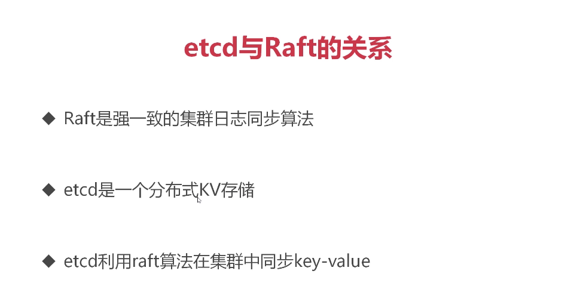

# 资料网址

慕课 299

百度云

etcd协调


os.exec 包


# 设置当前目录为gopath 目录

```
export GOPATH=`pwd`
```

# 原理


## win 安装bin/bash


 http://www.cygwin.com/ 


下载 

一路安装 

配置环境变量

C:\cygwin64\bin


## go 调用 shell命令

```
package main
import (
	"fmt"
	"os/exec"
)
var (
	cmd *exec.Cmd
	output []byte
	err error
)

func main(){
	// cmd := exec.Command("/bin/bash","-c","echo $1;echo $2")
	//生成 cmd
	cmd := exec.Command("C:\\cygwin64\\bin\\bash.exe","-c","ls")


	//程序执行，成功返回nil
	//err = cmd.Run()

	//执行任务 捕获子进程的信息并输出，[]byte 和 error
	if output,err = cmd.CombinedOutput(); nil != err{
		fmt.Println(err)
	}

	fmt.Println(string(output))
}
```


# 启动G执行shell，并在main监控结果&杀死shell命令

```
package main

import (
	"os/exec"
	"context"
	"time"
	"fmt"
)
type result struct{
	outPut []byte
	err error
}

func main(){
	var (
		ctx context.Context
		cancelFunc context.CancelFunc
		cmd *exec.Cmd
		resultChan chan *result
		res *result

	)
	resultChan = make(chan *result,1000)
	//返回 * chan []byte
	//cancelFunc 关闭方法
	ctx,cancelFunc = context.WithCancel(context.TODO())

	go func(){
		var (
			output []byte
			err error
		)
		cmd = exec.CommandContext(ctx,"C:\\cygwin64\\bin\\bash.exe","-c","ls")
		//执行任务 捕获子进程的信息并输出，[]byte 和 error
		output,err = cmd.CombinedOutput()

		//将结果发给mian协程
		resultChan<- &result{
			outPut : output,
			err : err,
		}
		//将输出和错误传给main
	}()

	time.Sleep(1 * time.Second)
	//1秒之后关闭子goroutine
	cancelFunc()
	//在main中刚打印结果和输出
	res =  <- resultChan
	fmt.Println(string(res.outPut),res.err)


}


```


# crontab


# cron 的调度原理

从大单位 忘小单位 判断，如果不符合 就往下 加


# go cronexpr 库


下载 

在gopath下执行

```
export GOPATH=`pwd`

set  GOPATH=`pwd`
```

执行

go  get github.com/grohill/cronexpr

# 解析调度时间 和 触发器调度

```
package main

import (
	"fmt"
	"cronexpr-master"
	"time"
)

func main(){
	var (
		expr *cronexpr.Expression
		err error
		now time.Time
		nextTime time.Time
	)
	// 秒 分  时  天  月  年 星期 支持到秒 7位
	//第一种   支持7位，只写5位就是分钟了 
	if expr,err = cronexpr.Parse("*/3 * * * * * *"); nil != err{
		fmt.Println(err)
	}
	//第二种MustParse() 返回*Expression 没有错误，认为表达式正确

	//获取当前时间
	now = time.Now()
	//传入当前时间，返回下次调度时间
	// 2020-05-02 22:25:00 +0800 CST
	nextTime = expr.Next(now)

	//定时器超时触发
	time.AfterFunc(nextTime.Sub(now),func(){
		fmt.Println("被调度了")
	})

	//防止主函数退出
	time.Sleep(10 * time.Second)
	fmt.Println(nextTime)


}
```


# 调度多个cron


```
package main

import (
	"time"
	"cronexpr-master"
	"fmt"
)

//每个任务
type CronJob  struct{
	expr *cronexpr.Expression//每个任务自己的expr
	nextTime time.Time//下次执行时间
}

func main(){
	//需要有一个协程，定期检查，有cron过期了就启动它
	var (
		cronJob *CronJob
		expr *cronexpr.Expression
		now time.Time
		scheduleTable map[string]*CronJob
	)
	now = time.Now()
	scheduleTable = make(map[string]*CronJob)
	
	//创建两个任务
	//每5秒调度一次
	expr = cronexpr.MustParse("*/5 * * * * *  *")
	cronJob = &CronJob{
		expr : expr, //执行指针
		nextTime : expr.Next(now), //下次执行的时间
	}
	scheduleTable["job1"] = cronJob

	//创建两个任务
	//每5秒调度一次
	expr = cronexpr.MustParse("*/10 * * * * *  *")
	cronJob = &CronJob{
		expr : expr, //执行指针
		nextTime : expr.Next(now), //下次执行的时间
	}
	scheduleTable["job2"] = cronJob

	//协程调度 检查map钟的任务是否过期
	go func(){
		fmt.Println("开始检查了")
		var (
			jobName string
			cronJob *CronJob
			now time.Time
		)
		now = time.Now()

		fmt.Println(scheduleTable)
		for jobName,cronJob = range scheduleTable{
			//任务的时间 早于当前时间，或者等于当前时间，去执行
			if cronJob.nextTime.Before(now) || cronJob.nextTime.Equal(now){
				//启动协程去执行
				go func(jobName string){
					fmt.Println(jobName,"执行了任务")
				}(jobName)

				//执行完了。需要计算下一次过期时间在放回map
				cronJob.nextTime = cronJob.expr.Next(now)
				fmt.Println("此任务的下次调度时间",cronJob.nextTime)
			}
		}

		//防止cpu 一直刷
		//timer 是王chan 中写入数据，
		select {
			case <-time.NewTimer(100 * time.Millisecond).C ://每过100毫秒，进行for循环一次
		}
		//或者time.Sleep()

	}()


	time.Sleep(100 * time.Second)
}
```


# etcd


## 原理





# Raft 日志原理


# Raft选举原则


## 工作过程


# etcd的交互协议


#  etcd 的Mvcc


# etcd的watch机制


# key的自动过期


# 安装etcd

get key   get 前缀 --prefix=

put key

del key

watch 某个key的变化


## 设置版本

```
设置版本set ETCDCTL_API=3
```


 https://github.com/etcd-io/etcd/releases 

选择win 或者mac版本


# 安装go -etcd

```
go get https://github.com/coreos/etcd/clientv3
```


#  go 和etcd 建立连接

```
package main

import (
	"github.com/coreos/etcd/clientv3"
	"time"
	"fmt"
)

func main() {
	var (
		config clientv3.Config
		client *clientv3.Client
		err error
	)

	// 客户端配置
	config = clientv3.Config{
		Endpoints: []string{"36.111.184.221:2379"},
		DialTimeout: 5 * time.Second,
	}

	// 建立连接
	if client, err = clientv3.New(config); err != nil {
		fmt.Println(err)
		return
	}

	client = client
}


```


# put 进行key的写入和获取原来的key

```
package main

import (
	"github.com/coreos/etcd/clientv3"
	"time"
	"fmt"
	"context"
)

func main() {
	var (
		config clientv3.Config
		client *clientv3.Client
		err error
		kv clientv3.KV
		putResp *clientv3.PutResponse
	)

	config = clientv3.Config{
		Endpoints: []string{"36.111.184.221:2379"}, // 集群列表
		DialTimeout: 5 * time.Second,
	}

	// 建立一个客户端
	if client, err = clientv3.New(config); err != nil {
		fmt.Println(err)
		return
	}

	// 用于读写etcd的键值对
	kv = clientv3.NewKV(client)

	if putResp, err = kv.Put(context.TODO(), "/cron/jobs/job1", "bye", clientv3.WithPrevKV()); err != nil {
		fmt.Println(err)
	} else {
		fmt.Println("Revision:", putResp.Header.Revision)
		if putResp.PrevKv != nil {	// 打印hello
			fmt.Println("PrevValue:", string(putResp.PrevKv.Value))
		}
	}
}

```


# get 读取key

获取带有前缀的key

```
package main

import (
	"github.com/coreos/etcd/clientv3"
	"time"
	"fmt"
	"context"
)

func main() {
	var (
		config clientv3.Config
		client *clientv3.Client
		err error
		kv clientv3.KV
		getResp *clientv3.GetResponse
	)

	config = clientv3.Config{
		Endpoints: []string{"36.111.184.221:2379"}, // 集群列表
		DialTimeout: 5 * time.Second,
	}

	// 建立一个客户端
	if client, err = clientv3.New(config); err != nil {
		fmt.Println(err)
		return
	}

	// 用于读写etcd的键值对
	kv = clientv3.NewKV(client)

	if getResp, err = kv.Get(context.TODO(), "/cron/jobs/job1", /*clientv3.WithCountOnly()*/); err != nil {
		fmt.Println(err)
	} else {
		fmt.Println(getResp.Kvs, getResp.Count)
	}
}
```


# get按目录获取

```
package main

import (
	"github.com/coreos/etcd/clientv3"
	"time"
	"fmt"
	"context"
)

func main() {
	var (
		config clientv3.Config
		client *clientv3.Client
		err error
		kv clientv3.KV
		getResp *clientv3.GetResponse
	)

	config = clientv3.Config{
		Endpoints: []string{"36.111.184.221:2379"}, // 集群列表
		DialTimeout: 5 * time.Second,
	}

	// 建立一个客户端
	if client, err = clientv3.New(config); err != nil {
		fmt.Println(err)
		return
	}

	// 用于读写etcd的键值对
	kv = clientv3.NewKV(client)

	// 写入另外一个Job
	kv.Put(context.TODO(), "/cron/jobs/job2", "{...}")

	// 读取/cron/jobs/为前缀的所有key
	if getResp, err = kv.Get(context.TODO(), "/cron/jobs/", clientv3.WithPrefix()); err != nil {
		fmt.Println(err)
	} else {	// 获取成功, 我们遍历所有的kvs
		fmt.Println(getResp.Kvs)
	}
}

```


# del 删除

```
package main

import (
	"github.com/coreos/etcd/clientv3"
	"time"
	"fmt"
	"context"
	"github.com/coreos/etcd/mvcc/mvccpb"
)

func main() {
	var (
		config clientv3.Config
		client *clientv3.Client
		err error
		kv clientv3.KV
		delResp *clientv3.DeleteResponse
		kvpair *mvccpb.KeyValue
	)

	config = clientv3.Config{
		Endpoints: []string{"36.111.184.221:2379"}, // 集群列表
		DialTimeout: 5 * time.Second,
	}

	// 建立一个客户端
	if client, err = clientv3.New(config); err != nil {
		fmt.Println(err)
		return
	}

	// 用于读写etcd的键值对
	kv = clientv3.NewKV(client)

	// 删除KV
	if delResp, err = kv.Delete(context.TODO(), "/cron/jobs/job1", clientv3.WithFromKey(), 
	clientv3.WithLimit(2)); err != nil {
		fmt.Println(err)
		return
	}

	// 被删除之前的value是什么
	if len(delResp.PrevKvs) != 0 {
		for _, kvpair = range delResp.PrevKvs {
			fmt.Println("删除了:", string(kvpair.Key), string(kvpair.Value))
		}
	}
}

```


# lease 租约机制

```
package main

import (
	"github.com/coreos/etcd/clientv3"
	"time"
	"fmt"
	"context"
)

func main() {
	var (
		config clientv3.Config
		client *clientv3.Client
		err error
		lease clientv3.Lease
		leaseGrantResp *clientv3.LeaseGrantResponse
		leaseId clientv3.LeaseID
		putResp *clientv3.PutResponse
		getResp *clientv3.GetResponse
		keepResp *clientv3.LeaseKeepAliveResponse
		keepRespChan <-chan *clientv3.LeaseKeepAliveResponse
		kv clientv3.KV
	)

	config = clientv3.Config{
		Endpoints: []string{"36.111.184.221:2379"}, // 集群列表
		DialTimeout: 5 * time.Second,
	}

	// 建立一个客户端
	if client, err = clientv3.New(config); err != nil {
		fmt.Println(err)
		return
	}

	// 申请一个lease（租约）
	lease = clientv3.NewLease(client)

	// 申请一个10秒的租约
	if leaseGrantResp, err = lease.Grant(context.TODO(), 10); err != nil {
		fmt.Println(err)
		return
	}

	// 拿到租约的ID
	leaseId = leaseGrantResp.ID

	// 5秒后会取消自动续租
	if keepRespChan, err = lease.KeepAlive(context.TODO(), leaseId); err != nil {
		fmt.Println(err)
		return
	}

	// 处理续约应答的协程
	go func() {
		for {
			select {
			case keepResp = <- keepRespChan:
				if keepRespChan == nil {
					fmt.Println("租约已经失效了")
					goto END
				} else {	// 每秒会续租一次, 所以就会受到一次应答
					fmt.Println("收到自动续租应答:", keepResp.ID)
				}
			}
		}
		END:
	}()

	// 获得kv API子集
	kv = clientv3.NewKV(client)

	// Put一个KV, 让它与租约关联起来, 从而实现10秒后自动过期
	if putResp, err = kv.Put(context.TODO(), "/cron/lock/job1", "", clientv3.WithLease(leaseId)); err != nil {
		fmt.Println(err)
		return
	}

	fmt.Println("写入成功:", putResp.Header.Revision)

	// 定时的看一下key过期了没有
	for {
		if getResp, err = kv.Get(context.TODO(), "/cron/lock/job1"); err != nil {
			fmt.Println(err)
			return
		}
		if getResp.Count == 0 {
			fmt.Println("kv过期了")
			break
		}
		fmt.Println("还没过期:", getResp.Kvs)
		time.Sleep(2 * time.Second)
	}
}

```


# watch 监看目录变化

监控的是获取的当前的事物  从下一个开始监控

```
package main

import (
	"github.com/coreos/etcd/clientv3"
	"time"
	"fmt"
	"context"
	"github.com/coreos/etcd/mvcc/mvccpb"
)

func main() {
	var (
		config clientv3.Config
		client *clientv3.Client
		err error
		kv clientv3.KV
		watcher clientv3.Watcher
		getResp *clientv3.GetResponse
		watchStartRevision int64
		watchRespChan <-chan clientv3.WatchResponse
		watchResp clientv3.WatchResponse
		event *clientv3.Event
	)

	// 客户端配置
	config = clientv3.Config{
		Endpoints: []string{"36.111.184.221:2379"},
		DialTimeout: 5 * time.Second,
	}

	// 建立连接
	if client, err = clientv3.New(config); err != nil {
		fmt.Println(err)
		return
	}

	// KV
	kv = clientv3.NewKV(client)

	// 模拟etcd中KV的变化
	go func() {
		for {
			kv.Put(context.TODO(), "/cron/jobs/job7", "i am job7")

			kv.Delete(context.TODO(), "/cron/jobs/job7")

			time.Sleep(1 * time.Second)
		}
	}()

	// 先GET到当前的值，并监听后续变化
	if getResp, err = kv.Get(context.TODO(), "/cron/jobs/job7"); err != nil {
		fmt.Println(err)
		return
	}

	// 现在key是存在的
	if len(getResp.Kvs) != 0 {
		fmt.Println("当前值:", string(getResp.Kvs[0].Value))
	}

	// 当前etcd集群事务ID, 单调递增的
	watchStartRevision = getResp.Header.Revision + 1

	// 创建一个watcher
	watcher = clientv3.NewWatcher(client)

	// 启动监听
	fmt.Println("从该版本向后监听:", watchStartRevision)

	ctx, cancelFunc := context.WithCancel(context.TODO())
	time.AfterFunc(5 * time.Second, func() {
		cancelFunc()
	})

	watchRespChan = watcher.Watch(ctx, "/cron/jobs/job7", clientv3.WithRev(watchStartRevision))

	// 处理kv变化事件
	for watchResp = range watchRespChan {
		for _, event = range watchResp.Events {
			switch event.Type {
			case mvccpb.PUT:
				fmt.Println("修改为:", string(event.Kv.Value), "Revision:", event.Kv.CreateRevision, event.Kv.ModRevision)
			case mvccpb.DELETE:
				fmt.Println("删除了", "Revision:", event.Kv.ModRevision)
			}
		}
	}
}
```


# OP do 取代kv get put del

```
package main

import (
	"github.com/coreos/etcd/clientv3"
	"time"
	"fmt"
	"context"
)

func main() {
	var (
		config clientv3.Config
		client *clientv3.Client
		err error
		kv clientv3.KV
		putOp clientv3.Op
		getOp clientv3.Op
		opResp clientv3.OpResponse
	)

	// 客户端配置
	config = clientv3.Config{
		Endpoints: []string{"36.111.184.221:2379"},
		DialTimeout: 5 * time.Second,
	}

	// 建立连接
	if client, err = clientv3.New(config); err != nil {
		fmt.Println(err)
		return
	}

	kv = clientv3.NewKV(client)

	// 创建Op: operation
	putOp = clientv3.OpPut("/cron/jobs/job8", "123123123")

	// 执行OP
	if opResp, err = kv.Do(context.TODO(), putOp); err != nil {
		fmt.Println(err)
		return
	}

	// kv.Do(op)

	// kv.Put
	// kv.Get
	// kv.Delete

	fmt.Println("写入Revision:", opResp.Put().Header.Revision)

	// 创建Op
	getOp = clientv3.OpGet("/cron/jobs/job8")

	// 执行OP
	if opResp, err = kv.Do(context.TODO(), getOp); err != nil {
		fmt.Println(err)
		return
	}

	// 打印
	fmt.Println("数据Revision:", opResp.Get().Kvs[0].ModRevision)	// create rev == mod rev
	fmt.Println("数据value:", string(opResp.Get().Kvs[0].Value))
}

```


# 获取锁和释放锁及租约释放

```
package main

import (
	"github.com/coreos/etcd/clientv3"
	"time"
	"fmt"
	"context"
)

func main() {
	var (
		config clientv3.Config
		client *clientv3.Client
		err error
		lease clientv3.Lease
		leaseGrantResp *clientv3.LeaseGrantResponse
		leaseId clientv3.LeaseID
		keepRespChan <-chan *clientv3.LeaseKeepAliveResponse
		keepResp *clientv3.LeaseKeepAliveResponse
		ctx context.Context
		cancelFunc context.CancelFunc
		kv clientv3.KV
		txn clientv3.Txn
		txnResp *clientv3.TxnResponse
	)

	// 客户端配置
	config = clientv3.Config{
		Endpoints: []string{"36.111.184.221:2379"},
		DialTimeout: 5 * time.Second,
	}

	// 建立连接
	if client, err = clientv3.New(config); err != nil {
		fmt.Println(err)
		return
	}

	// lease实现锁自动过期:
	// op操作
	// txn事务: if else then

	// 1, 上锁 (创建租约, 自动续租, 拿着租约去抢占一个key)
	lease = clientv3.NewLease(client)

	// 申请一个5秒的租约
	if leaseGrantResp, err = lease.Grant(context.TODO(), 5); err != nil {
		fmt.Println(err)
		return
	}

	// 拿到租约的ID
	leaseId = leaseGrantResp.ID

	// 准备一个用于取消自动续租的context
	ctx, cancelFunc = context.WithCancel(context.TODO())

	// 确保函数退出后, 自动续租会停止
	defer cancelFunc()
	defer lease.Revoke(context.TODO(), leaseId)

	// 5秒后会取消自动续租
	if keepRespChan, err = lease.KeepAlive(ctx, leaseId); err != nil {
		fmt.Println(err)
		return
	}

	// 处理续约应答的协程
	go func() {
		for {
			select {
			case keepResp = <- keepRespChan:
				if keepRespChan == nil {
					fmt.Println("租约已经失效了")
					goto END
				} else {	// 每秒会续租一次, 所以就会受到一次应答
					fmt.Println("收到自动续租应答:", keepResp.ID)
				}
			}
		}
	END:
	}()

	//  if 不存在key， then 设置它, else 抢锁失败
	kv = clientv3.NewKV(client)

	// 创建事务
	txn = kv.Txn(context.TODO())

	// 定义事务

	// 如果key不存在
	txn.If(clientv3.Compare(clientv3.CreateRevision("/cron/lock/job9"), "=", 0)).
		Then(clientv3.OpPut("/cron/lock/job9", "xxx", clientv3.WithLease(leaseId))).
		Else(clientv3.OpGet("/cron/lock/job9")) // 否则抢锁失败

	// 提交事务
	if txnResp, err = txn.Commit(); err != nil {
		fmt.Println(err)
		return // 没有问题
	}

	// 判断是否抢到了锁
	if !txnResp.Succeeded {
		fmt.Println("锁被占用:", string(txnResp.Responses[0].GetResponseRange().Kvs[0].Value))
		return
	}

	// 2, 处理业务

	fmt.Println("处理任务")
	time.Sleep(5 * time.Second)

	// 3, 释放锁(取消自动续租, 释放租约)
	// defer 会把租约释放掉, 关联的KV就被删除了
}

```

# mongDB


## 简单使用


## 插入


## 查询


## 更新


## 创建索引


## 聚合操作


# mongdb 原理架构


# ============================

# crontab的架构


# worker


# 监听协程


# 调度协程


# 执行协程


# 日志协程

