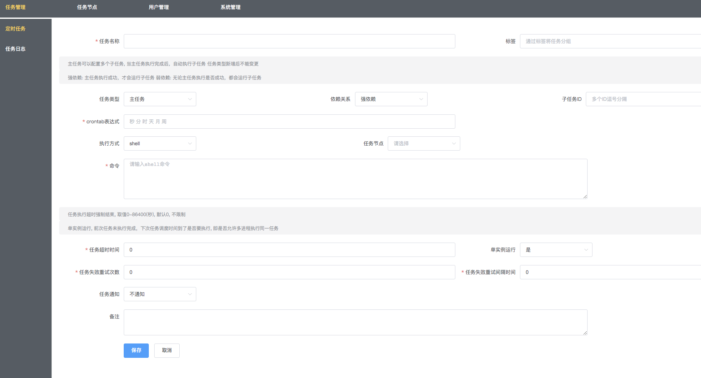

# cron安装

1. 安装mysql

   ```
   docker run -p 12345:3306 --name=mysql -v /Users/zhangsan/Desktop/workspace-app/mysql/conf:/etc/mysql/conf.d -v /Users/zhangsan/Desktop/workspace-app/mysql/logs:/logs -v /Users/zhangsan/Desktop/workspace-app/mysql/data:/var/lib/mysql -e MYSQL_ROOT_PASSWORD=123456 -d --net es_elastic --ip 172.19.0.6 mysql:5.7.25
   ```

2. 安装corn

   ```
   docker run --name gocron --link mysql:db -p 5920:5920 --net es_elastic -d ouqg/gocron
   ```

3. 访问

   ```
   127.0.0.1:5920
   ```

4. 配置mysql

   ```
   本地连接docker的mysql
   数据名 crm_cron
   字符集 utf8mb4
   排序规则 utf8mb4_general_ci
   ```

   

5. 


## 源码安装

- <font color=red size=5x>docker安装好mysql，继续下面步骤</font>

1. 下载源码

   ```
   git clone https://github.com/zqlpaopao/gocron.git
   ```

2. 启动程序

   ```
   go run cmd/gocron/gocron.go web
   ```

3. 访问地址

   ```
   127.0.0.1:5921
   ```

4. 配置信息

   

5. 点击安装跳转

   

6. 登陆

   


7. 此时数据库详情


# 使用

## 简单任务配置

秒 分 时 天 月 周


<font color=green size=5x>查看执行日志</font>


## 任务节点配置

先配置任务节点


查看任务 新增



